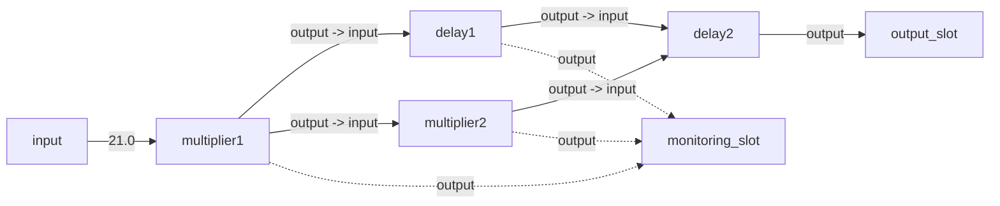

# MultiplierExample

This is a working example of a simulation using the [nexosim](https://docs.rs/nexosim/latest/nexosim/) crate. The example demonstrates a simple multiplier component that processes numbers and collects statistics.

## Model structure


## Overview

This example shows how to:
- Set up a basic simulation with nexosim
- Create a custom component (Multiplier)
- Create a custom component with delay (Delay)
- Connect components via ports
- Run the simulation
- Collect and display statistics

## Implementation Details

The example contains a `Multiplier` component that:
- Takes a number input
- Multiplies it by a configurable factor
- Outputs the result

## Running the Example

To run the example:

```bash
cargo run
```

## Dependencies

- nexosim: The simulation framework

## Project Structure

- `src/main.rs`: Main simulation code

## Statistics

The example collects the following statistics:
- Total number of multiplications performed
- Average input value
- Average output value
- Maximum output value

## Additional Resources

For more information, see the [nexosim documentation](https://docs.rs/nexosim/latest/nexosim/).