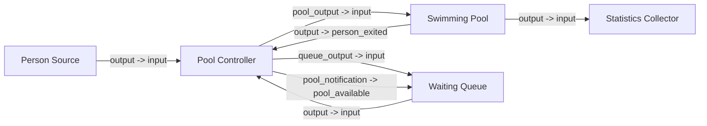

# SwimPoolSim - Swimming Pool Capacity Simulation

## Scenario Description
This simulation models a swimming pool with the following characteristics:

- The swimming pool has a maximum capacity of X persons
- Swimmers arrive according to a uniform distribution (configured in config.toml)
- The time swimmers spend in the pool follows a uniform distribution (configured in config.toml)
- When the pool reaches maximum capacity, new arrivals must wait in a queue

This model scenario and model was derived from [SwimPool Simulation written in SLX](swhalle_simple.slx).

## Configuration
Parameters for the simulation can be adjusted in the `config.toml` file.

## Model Structure


## Project Structure
The project is organized as follows:

- `src/` - Contains the source code of the simulation
    - `config.rs` - Configuration handling
    - `main.rs` - Entry point for the application
    - `models.rs` - Contains model components (Person, Pool, etc.)
    - `utils.rs` - Utility functions (statistic calculations, etc.)
- `config.toml` - Configuration file to adjust simulation parameters
- `Cargo.toml` - Project dependencies and metadata
- `data/` - Output directory for simulation results

## How to Run

### Requirements
- Rust and Cargo installed (https://www.rust-lang.org/tools/install)

### Running the Simulation
1. Clone the repository:
   ```
   git clone git@github.com:a-schulz/ds-final-simulation.git
   ```

2. Navigate to the project directory:
   ```
   cd ds-final-simulation/SimPoolSim
   ```

3. Adjust simulation parameters in `config.toml` as needed

4. Run the simulation:
   ```
   cargo run --release
   ```

5. For development and testing:
   ```
   cargo run
   ```

The simulation will output results to the console and save detailed statistics to the `data/` directory.