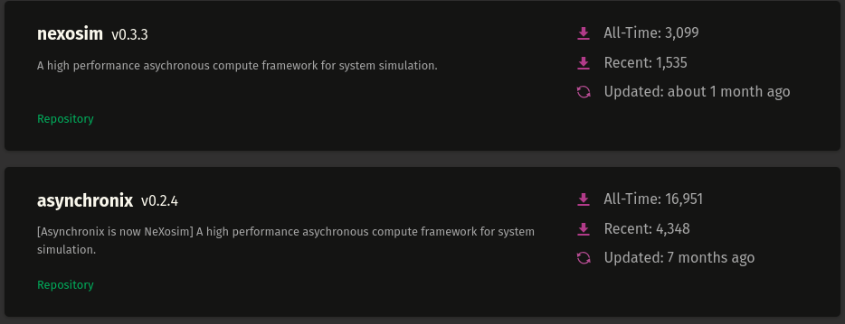
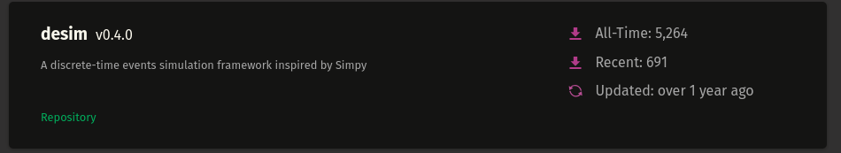
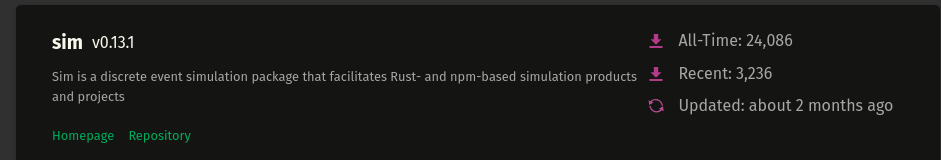
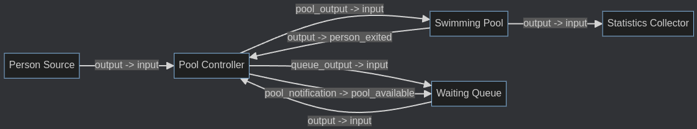

= Abschlussprojekt "Diskrete Simulation" SS2025
:toc: left
:toclevels: 3
:sectnums:
:source-highlighter: highlight.js
:icons: font
:logo: pi/logo/logo_bpa.svg
:toc-title: Inhaltsübersicht
:pdf-page-size: A4
:figure-caption: Abbildung
:table-caption: Tabelle
:toc: preamble

Modul: Diskrete Simulation

Studiengang: Angewandte Informatik

Professor: Prof. T. Wiedemann

Author: Alexander Schulz (alexander.schulz2@stud.htw-dresden.de)

<<<<

== Einleitung

In diesem Abschlussprojekt für das Modul "Diskrete Simulation" wurde eine Simulation eines Schwimmbadsystems implementiert. Das Projekt demonstriert die Anwendung von Konzepten der diskreten Simulation zur Modellierung und Analyse eines Systems mit beschränkter Kapazität und Steuerungselementen. Ziel des Projektes ist es, die Eignung und Performance von Nexosim, einem Rust-basierten Framework für diskrete Ereignissimulationen, zu evaluieren.

== Auswahl der Simulationsumgebung

Bei der Auswahl einer geeigneten Simulationsumgebung in Rust wurden mehrere Crates verglichen und bewertet. Die Bewertungskriterien umfassten:

- Aktive Weiterentwicklung des Crates
- Qualität der Dokumentation
- Performance-Eigenschaften
- Verbreitungsgrad (Anzahl der Downloads auf crates.io)

=== Verglichene Crates

==== Nexosim

==== Desim
[Link: desim - Rust](https://docs.rs/desim/latest/desim/)

Hinweis: Nexosim hieß vorher Asynchronix und wird unter diesem Namen noch in vielen Projekten verwendet, was die hohe Anzahl an Downloads erklärt.

==== SimRS
[Link: SimRS · SimRS](https://simrs.com/)

=== Begründung für die Auswahl von Nexosim

Nach Abwägung der verschiedenen Optionen fiel die Wahl auf Nexosim. Ausschlaggebend waren:

- Umfangreiche und verständliche Dokumentation (Beispiele vorhanden)
- Aktive Weiterentwicklung mit regelmäßigen Updates
- Vorteilhafte Performance-Eigenschaften
- Wird bereits bei anderen Projekten verwendet (Downloads auf crates.io)

=== NeXosim Framework: Kernkomponenten und Paradigmen
_(Übersetzung und Zusammenfassung der Projekt-README)_

NeXosim ist ein hochoptimiertes Framework für diskrete Ereignissimulationen in Rust, das durch seinen komponentenorientierten Ansatz und eine asynchrone Implementierung besticht. Das Framework unterstützt sowohl einfache Simulationen als auch komplexe Simulationsszenarien mit zeitgesteuerten Zustandsautomaten.

==== Kernkomponenten von NeXosim

1. **Modelle** (Models): Die grundlegenden Bausteine einer Simulation, die als isolierte Entitäten mit definierten Ein- und Ausgängen fungieren und durch Ereignisse kommunizieren.

2. **Mailboxen** (Mailboxes): Empfangen Nachrichten für ein bestimmtes Modell und fungieren als Schnittstelle für den asynchronen Nachrichtenaustausch.

3. **Ports**: Typisierte Ein- und Ausgänge für Modelle:
- `Output<T>`: Sendet Ereignisse an verbundene Modelle
- `EventSlot<T>`: Empfängt Ereignisse für weitere Verarbeitung

4. **Kontext** (Context): Ermöglicht Modellen, Ereignisse zu planen und auf Ressourcen zuzugreifen.

5. **Scheduler**: Verwaltet die Ereignisreihenfolge und den zeitlichen Fortschritt der Simulation.

==== Zentrale Paradigmen

==== Aktormodell
NeXosim implementiert das Aktormodell, bei dem jedes Simulationsmodell als eigenständiger Aktor fungiert, der seinen internen Zustand verwaltet und über Nachrichtenaustausch mit anderen Aktoren kommuniziert.

==== Component-Flow Architecture
Die Architektur ähnelt dem Flow-Based Programming (FBP), wobei Modelle durch definierte Verbindungen miteinander kommunizieren, was eine klare Trennung der Komponenten und eine übersichtliche Systemstruktur ermöglicht.

==== Diskrete Ereignissimulation
Die Simulation schreitet in diskreten Zeitschritten voran. Der Scheduler wählt nach Abschluss der Berechnungen für den aktuellen Zeitpunkt den nächsten Zeitpunkt (Next Event Increment), zu dem Ereignisse geplant sind.

==== Parallele Ausführung
NeXosim nutzt Rusts Unterstützung für Multithreading und asynchrone Programmierung, um Simulationsmodelle effizient parallel auszuführen, wobei die erforderliche Synchronisierung transparent vom Simulator gehandhabt wird.

Weitere Informationen und Dokumentation finden Sie unter:

- [GitHub Repository](https://github.com/asynchronics/nexosim)
- [API-Dokumentation](https://docs.rs/nexosim)
- [Crates.io Seite](https://crates.io/crates/nexosim)

Die modulare Struktur und die klaren Schnittstellen machen NeXosim zu einer leistungsstarken Wahl für die Modellierung komplexer Systeme wie das in diesem Projekt implementierte Schwimmbadsystem.

== Systemanalyse und Abstraktion

=== Problemstellung

Die Aufgabe bestand in der Modellierung eines Schwimmbadsystems, bei dem die maximale Belegung überwacht und gesteuert werden muss. Personen betreten und verlassen das Schwimmbad, wobei die Gesamtkapazität nicht überschritten werden darf.

=== Abstraktion des Systems

Das Schwimmbadsystem wurde auf folgende Kernelemente abstrahiert:

- Eingangsbereich (PersonSource)
- Warteschlange, falls das Schwimmbad belegt ist (WaitingQueue)
- Schwimmbereich mit begrenzter Kapazität (SwimmingPool)
- Steuerungseinheit (PoolController) zur Überwachung der Belegung

Diese Abstraktion ermöglicht eine übersichtliche Modellierung des Systems und erlaubt die Simulation verschiedener Belegungsszenarien.

== Konzeption

Die Konzeption des Simulationsmodells folgte einem strukturierten Ansatz. Zunächst wurden Basismodelle für die verschiedenen Komponenten des Systems entwickelt. Anschließend wurde ein Controller eingeführt, der die maximale Belegung im Schwimmbad überwacht und steuert.

Die Modellstruktur zeigt die Interaktion zwischen den verschiedenen Komponenten und verdeutlicht den Fluss der Personen durch das System. Der Controller übernimmt dabei eine zentrale Rolle bei der Steuerung des Zugangs zum Schwimmbad.

== Implementierung

Alle Simulationen verwenden einen festen Seed, um reproduzierbare Ergebnisse zu gewährleisten, was besonders für Tests und Performance-Evaluationen wichtig ist.

=== Grundlegende Struktur

Die Implementierung folgt dem Model-Connect-Event-Prinzip:

1. **Instanz (Instance)**: Repräsentiert ein Modell in der Simulation
2. **Connect**: Verbindet verschiedene Modelle miteinander
3. **Events**: Werden von Instanzen ausgelöst und an die verbundenen Mailboxen weitergeleitet

=== Performance-Tests

Zur Evaluierung der Performance wurden verschiedene Testläufe durchgeführt.
Dabei wurde die folgende Konfiguration verwendet:

[source,toml]
----
[simulation]

arrival_min = 2.0
arrival_max = 8.0

max_swimmers = 15

swim_time_min = 30.0
swim_time_max = 90.0

simulation_time = 2400.0

debug_enabled = false
----

==== Simulation mit Debug-Ausgaben (Development-Build)
[source,text]
----
include::logs/dev_run_with_debug.txt[]
----

==== Simulation ohne Debug-Ausgaben (Development-Build)
[source,text]
----
include::logs/dev_run_without_debug.txt[]
----

==== Simulation mit Debug-Ausgaben (Release-Build)
[source, text]
----
include::logs/release_run_with_debug.txt[]
----

==== Simulation ohne Debug-Ausgaben (Release-Build)
[source,text]
----
include::logs/release_run_without_debug.txt[]
----

Die Performance-Tests zeigen, dass Nexosim in der Lage ist, auch komplexe Simulationsszenarien effizient zu verarbeiten. Die Release-Builds bieten eine signifikante Performance-Steigerung im Vergleich zu den Development-Builds, insbesondere bei deaktivierten Debug-Ausgaben mit nur **7.22 ms**.

Für weitere Tests können die Simulationen mit angepassten Parametern (`config.toml`) durchgeführt werden.

== Herausforderungen und Erfahrungen

=== Herausforderungen bei der Implementierung

Die Arbeit mit Nexosim wies einige Herausforderungen auf:

1. **Fehlermeldungen**: Die Fehlermeldungen waren teilweise schwer verständlich (für unerfahrende Rust-Entwickler), wie das folgende Beispiel zeigt:
+
----
70 |     swimming_pool.output.connect(PoolController::person_exited, &controller_mbox);
   |                          ------- ^^^^^^^^^^^^^^^^^^^^^^^^^^^^^ the trait `for<'a> InputFn<'a, _, Person, _>` is not implemented for fn item `for<'a> fn(&'a mut PoolController) -> impl Future<Output = ()> {PoolController::person_exited}`
----

2. **Modell-Komplexität**: Die Modelle können schnell unübersichtlich werden, auch wenn eine gute Strukturierung prinzipiell möglich ist.

3. **Event-Nachverfolgung**: Da Events in Modellen definiert und später in der Main-Funktion verbunden werden, erfordert das Nachverfolgen des Programflusses ein Springen zwischen verschiedenen Codeteilen.
+
image::img/tracking_events.png[Tracking Events Diagram]

4. **Monitoring**: Die Integration von Monitoring-Funktionalitäten ist nicht trivial, aber durchaus machbar unter Verwendung einer `EventQueue`.

=== Bewertung und Erfahrungen

==== Modellierungskomfort
Bei vorhandenen Rust-Kenntnissen ist die Arbeit mit Nexosim vergleichsweise einfach, erfordert jedoch eine gewisse Einarbeitungszeit. Die Lernkurve ist vorhanden, aber zu bewältigen.

==== Flexibilität
Das Framework bietet eine hohe Flexibilität bei der Modellierung verschiedener Systeme. Die aktorbasierte Architektur ermöglicht eine klare Trennung der Komponenten und einen übersichtlichen Nachrichtenaustausch.

==== Funktionalität
Die Funktionalität von Nexosim ist für die Anforderungen einer diskreten Simulation gut geeignet. Es bietet alle notwendigen Funktionen für die Modellierung, Simulation. Für die Auswertung der Ergebnisse müssen jedoch zusätzliche Funktionen geschrieben werden.

==== Performance
Die Performance ist sehr gut und eignet sich vorraussichtlich auch für komplexere Simulationsmodelle.

==== Eignung für Studierende
Nexosim ist für Studierende geeignet, wenn grundlegende Kenntnisse in Rust vorhanden sind. Die Dokumentation und die vorhandenen Beispiele erleichtern den Einstieg.

== Fazit und Ausblick

Die Implementierung des Schwimmbadsystems mit Nexosim hat gezeigt, dass das Framework gut für die diskrete Simulation komplexer Systeme geeignet ist. Die Performance ist überzeugend und die Modellierungsmöglichkeiten sind vielseitig.

Für zukünftige Projekte könnte eine verbesserte Visualisierung der Simulationsergebnisse sowie eine vereinfachte Möglichkeit zum Monitoring von Zustandsänderungen sinnvoll sein.

== Anhang

=== Logging der Warteschlange
[source,text]
----
include::logs/queue_logic.txt[]
----
