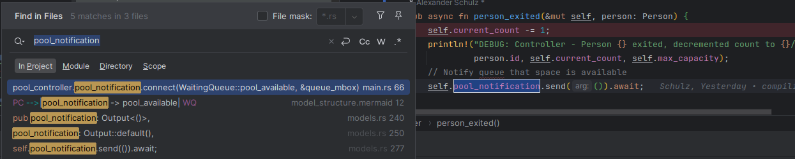

Simulation with println statements (dev build)
[source,text]
----
DEBUG: Person 474 entered pool. Current count: 9/15
DEBUG: Person 465 exited pool after 47.416666666666664 minutes. Current count: 8/15
DEBUG: Controller - Person 465 exited, decremented count to 8/15
DEBUG: Person 468 exited pool after 32.7 minutes. Current count: 7/15
DEBUG: Controller - Person 468 exited, decremented count to 7/15
DEBUG: Controller - Sending person 475 directly to pool. Current count: 8/15
DEBUG: Person 475 entered pool. Current count: 8/15
DEBUG: Controller - Sending person 476 directly to pool. Current count: 9/15
DEBUG: Person 476 entered pool. Current count: 9/15
DEBUG: Controller - Sending person 477 directly to pool. Current count: 10/15
DEBUG: Person 477 entered pool. Current count: 10/15
DEBUG: Controller - Sending person 478 directly to pool. Current count: 11/15
DEBUG: Person 478 entered pool. Current count: 11/15
DEBUG: Person 470 exited pool after 34.583333333333336 minutes. Current count: 10/15
DEBUG: Controller - Person 470 exited, decremented count to 10/15
DEBUG: Person 467 exited pool after 57.8 minutes. Current count: 9/15
DEBUG: Controller - Person 467 exited, decremented count to 9/15
DEBUG: Controller - Sending person 479 directly to pool. Current count: 10/15
DEBUG: Person 479 entered pool. Current count: 10/15
Wall clock execution time: 127.871258ms
----

Simulation without println statements (dev build)
[source,text]
----
Finished `dev` profile [unoptimized + debuginfo] target(s) in 0.06s
Running `target/debug/ds-smd-simulation`
Loaded configuration from config.toml
Wall clock execution time: 25.690053ms
Simulation completed successfully
----

Simulation without println statements (release build)
[source,text]
----
Finished `release` profile [optimized] target(s) in 0.05s
Running `target/release/ds-smd-simulation`
Loaded configuration from config.toml
Wall clock execution time: 8.205446ms
Simulation completed successfully
----

Instance
connect
on event fired by the instance
-> output gets directed to the specified mailbox

Fehlermeldungen teilweise nicht wirklich verständlich

----
70 |     swimming_pool.output.connect(PoolController::person_exited, &controller_mbox);
   |                          ------- ^^^^^^^^^^^^^^^^^^^^^^^^^^^^^ the trait `for<'a> InputFn<'a, _, Person, _>` is not implemented for fn item `for<'a> fn(&'a mut PoolController) -> impl Future<Output = ()> {PoolController::person_exited}`

----

Model kann schnell unübersichtlich werden, aber prinzipiell kann man es gut strukturieren

Da man in den Modellen nur events definiert und dann später in der Main verbindet, muss man ganz schön hin und her springen um dzu sehen wo man ankommt

Eine Möglichkeit bei jeder Funktion in den Modellen einen Breakpoint zu setzen und dann in der Main zu schauen wo es hingeht, ist aber auch nicht so schlecht

Performance ist gut

Einbauen von Monitoring ist nicht wirklich trivial, aber machbar

Lernkurve auf jeden Fall vorhanden

Some logs:
----
DEBUG: Controller - Sending person 0 to pool. Current count: 1/5
DEBUG: Controller - Sending person 1 to pool. Current count: 2/5
DEBUG: Controller - Sending person 2 to pool. Current count: 3/5
DEBUG: Controller - Sending person 3 to pool. Current count: 4/5
DEBUG: Controller - Sending person 4 to pool. Current count: 5/5
DEBUG: Controller - Pool full, sending person 5 to queue. Current count: 5/5
DEBUG: WaitingQueue - Person 5 added to queue. Queue length: 1
DEBUG: Controller - Pool full, sending person 6 to queue. Current count: 5/5
DEBUG: WaitingQueue - Person 6 added to queue. Queue length: 2
DEBUG: Controller - Pool full, sending person 7 to queue. Current count: 5/5
DEBUG: WaitingQueue - Person 7 added to queue. Queue length: 3
DEBUG: Controller - Pool full, sending person 8 to queue. Current count: 5/5
DEBUG: WaitingQueue - Person 8 added to queue. Queue length: 4
DEBUG: Controller - Pool full, sending person 9 to queue. Current count: 5/5
DEBUG: WaitingQueue - Person 9 added to queue. Queue length: 5
DEBUG: Controller - Pool full, sending person 10 to queue. Current count: 5/5
DEBUG: WaitingQueue - Person 10 added to queue. Queue length: 6
DEBUG: Controller - Person 4 exited, decremented count to 4/5
DEBUG: WaitingQueue - Person 5 left queue. Queue length: 5
DEBUG: Controller - Sending person 5 to pool. Current count: 5/5
DEBUG: Controller - Pool full, sending person 11 to queue. Current count: 5/5
----